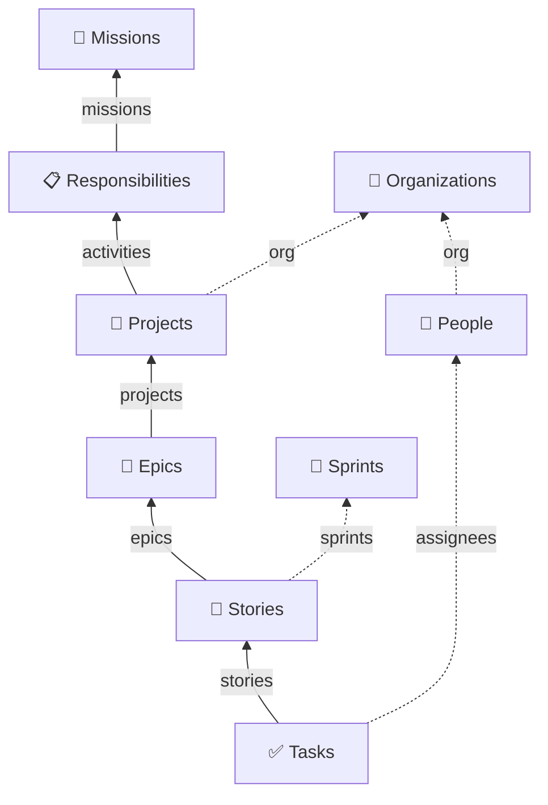

# MyLab

**An Obsidian vault for organizing academic work.**

MyLab models academic life as a single connected chain — from the broad *missions* of an
academic role down to the individual task you close this afternoon:

> **Missions → Responsibilities → Projects → Epics → Stories → Tasks**

Around that spine sit the people, organizations, sprints, meetings and daily notes that the
work actually happens with. Everything is plain Markdown with YAML frontmatter. There is no
database, no external service, and no script to run: the vault uses Obsidian's native
**Bases** feature to turn frontmatter links into live tables, card galleries and Kanban
boards, and it derives progress automatically — close a Task and its Story, Epic and Mission
all update themselves.

---

## ⚠️ Status: work in progress

This vault is used daily, but it is not finished. Several layers are **scaffolded but not yet
wired up** — dashboards and Bases exist for them, while the categories, folders and templates
that would feed them do not. Those parts will render as empty rather than break anything.
See [Known gaps](#known-gaps) for the honest list before you rely on something.

---
## The model

Each level is an ordinary note that points **upward** to its parent through a frontmatter
property. Nothing points downward — the child-to-parent links are enough, because Bases
reconstructs the reverse direction from backlinks.



| Level | Folder | Points up via | Status |
|---|---|---|---|
| **Missions** | `Missions/` | — (top of the chain) | derived: `Active Projects` / `Not Active Projects` |
| **Responsibilities** | `Responsibilities/` | `missions:` | derived, same two values |
| **Projects** | `Projects/` | `activities:` → Responsibilities, `org:` → Organizations | **you set it**: Backlog · Proposal · Ongoing · Closed |
| **Epics** | `Epics/` | `projects:` | derived from the Epic's Stories' Tasks |
| **Stories** | `Stories/` | `epics:`, `sprints:` | derived from the Story's Tasks |
| **Tasks** | `Tasks/` | `stories:`, `assignees:` | **you set it**: Backlog · Planning · In Progress · Done |

The four missions shipped with the vault reflect a typical academic mandate — **Teaching**,
**Research**, **Third Mission**, **Mentoring** — and the eight responsibilities beneath them
(Teaching in Class, Research, Dissemination, Funding Acquisition, PhD Supervision, Thesis
Supervision, Project Management, Technology Transfer) map onto them many-to-many. A single
responsibility can serve several missions: *PhD Supervision* counts toward Teaching, Research
**and** Mentoring at once.

Supporting entities: **Organizations**, **People**, **Sprints**, **Meetings**, **Daily
Notes**, and (scaffolded only) **Issues** and **References**.

---

## How it works

Three moving parts, and once you see them the whole vault becomes predictable.

### 1. `type:` is what makes a note a thing

Every note declares what it is by linking to a category note:

```yaml
---
type:
  - "[[Tasks]]"
---
```

The category notes live in `00 - Data/Categories/`. They are near-empty on purpose: their job
is to be a **link target** so that `type` is a real graph edge rather than a loose string.

### 2. Bases query on `type`

Each `.base` file in `00 - Data/Bases/` opens with the same filter shape:

```yaml
filters:
  and:
    - type.contains(link("Tasks"))
```

That single line is what collects every Task in the vault, wherever it lives. Each Base then
defines several **views** over that set — a table, a card gallery, a Kanban board — each with
its own extra filters. `Tasks.base`, for example, offers *Current Sprint* (Kanban), *All*
(table) and *Related* (cards).

### 3. Dashboards are one-line embeds

The numbered notes at the vault root are deliberately thin. `11 - Tasks.md` is, in full:

```markdown
---
cssclasses:
  - wide
  - hidden-properties
---

![[Tasks.base]]
```

`cssclasses` widens the page and hides the frontmatter panel so the board fills the window.
Views can be embedded individually with `![[Tasks.base#Current Sprint]]` — which is exactly
how the daily note pulls in your sprint board, and how a Project note shows only *its own*
epics.

### Status rolls up by itself

You only ever set a status on **Tasks** and **Projects**. Everything above is computed:

- **A Story** is `Done` when all its Tasks are done, `Backlog` when all are in backlog,
  `Planning` when all are planning, and `In Progress` in every mixed case.
- **An Epic** applies the same rule to all Tasks reachable through its Stories.
- **A Responsibility or Mission** counts as *Active* when at least one Project below it is not
  archived.

Because these are Bases formulas rather than stored properties, the Kanban boards built on
them are **read-only** — you cannot drag an Epic card between columns, and that is the point:
the only way to move an Epic forward is to actually finish its tasks. Boards built on a
writable property (Tasks, Projects) support drag-and-drop normally.

---

## Repository layout

```
MyLab/
├── Home.md                    # opens on launch — everything touched in the last 7 days
├── 01 - Organizations.md      # ─┐
├── 02 - People.md             #  │
├── 03 - Calendar.md           #  │  Dashboards.
├── 04 - References.md         #  │  Each one embeds a single Base view;
├── 05 - Missions.md           #  │  this is your navigation.
├── 06 - Responsibilities.md   #  │
├── 07 - Projects.md           #  │
├── 08 - Epics.md              #  │
├── 09 - Sprints.md            #  │
├── 10 - Stories.md            #  │
├── 11 - Tasks.md              #  │
├── 12 - Issues.md             #  │
├── 13 - Notes.md              #  │  (empty — see Known gaps)
├── 14 - Daily.md              # ─┘
│
├── 00 - Data/                 # all real content lives here
│   ├── Bases/                 # the 14 .base query definitions
│   ├── Categories/            # link targets for `type:`
│   ├── Templates/             # note templates
│   ├── Missions/  Responsibilities/  Projects/  Epics/  Stories/  Tasks/
│   ├── Organizations/  People/  Sprints/
│   └── Meetings/  Daily Notes/
│
└── .obsidian/
    ├── snippets/note-classes.css
    └── plugins/
        ├── banners/               # bundled — MIT
        └── generic-kanban-view/   # bundled — MIT
```

`Bases/`, `Categories/` and `Templates/` are hidden from the file explorer via
`userIgnoreFilters` in `app.json`. They are still fully editable — use the quick switcher
(`Cmd/Ctrl+O`) to open them.

---

## Installation

**Requirements:** Obsidian **1.10.0 or newer**. The bundled Kanban plugin depends on the
Bases API introduced in that version; on older releases the boards will not render.

1. **Clone the repo and open it as a vault.**

   ```bash
   git clone https://github.com/<your-username>/MyLab.git
   ```

   In Obsidian: *Open folder as vault* → select the cloned folder.

2. **Trust the vault.** Obsidian will ask before running the bundled community plugins.
   Choose *Trust author and enable plugins*.

3. **Verify the two bundled plugins are on.** *Settings → Community plugins* should list
   **Banners** and **Generic Kanban View**, both enabled. They ship inside the repo, so
   nothing needs downloading.

4. **Install Omnisearch yourself.** *Settings → Community plugins → Browse → Omnisearch*.
   It is **not** bundled here — it is third-party software and redistributing its compiled
   code in this repo would not be appropriate. It is already listed as enabled in
   `community-plugins.json`, so it will switch on by itself once installed.

   > On mobile, `app.json` binds pull-to-refresh to Omnisearch's modal. Until you install it,
   > that gesture does nothing. Everything else works without it.

5. **Confirm core plugins.** *Settings → Core plugins* — **Bases**, **Daily notes**,
   **Templates**, **Properties** and **Unique note creator** must be enabled. They already are
   in the committed config; this is just a sanity check.

Open `Home.md`. If you see a table of recently-modified notes, you are set up.

---

## Usage

### Making it yours

The vault ships with the author's own People and Organization notes as a worked example. To
adopt it:

1. **Keep or rewrite the Missions.** The four supplied missions suit most academic roles. Edit
   the note names if yours differ — links update automatically (`alwaysUpdateLinks` is on).
2. **Adjust the Responsibilities** in `00 - Data/Responsibilities/` to match what you're
   actually accountable for, pointing each at the right missions.
3. **Replace the example content.** Delete `People/Camillo Maria Caruso.md`,
   `Organizations/UCBM.md`, and the `GNB26` project, epic, stories and tasks — or keep them
   until you've seen how a filled-in hierarchy behaves, then remove them.
4. **Add yourself.** Create your own People note (see below) and your institution.

### Creating a note

Every entity has a template. Create the note in the right folder, then press
**`Cmd/Ctrl+Alt+T`** (*Insert template*) and pick the matching one.

**People are composed from two templates.** Start with `People Template` for the base note
(type, email, org, image, archive), then insert **one** role add-on on top of it:

- `Employee Template` → adds `title`, `role`, `org`
- `Researcher Template` → adds `org`, `department`, `unit`, `orcID`

These two are intentionally partial — they are property fragments, not standalone note types,
which is why they carry no `type:` of their own.

### The daily loop

Open `14 - Daily.md` or create today's daily note (`00 - Data/Daily Notes/`). The daily
template embeds `Tasks.base#Current Sprint`, so your board is the first thing you see. Drag
cards between **Backlog → Planning → In Progress → Done**; the drag writes `status:` straight
into the task's frontmatter, and the Story and Epic boards recompute on the next refresh.

Use the **quick filter chips** above a board (`Assignees · All`, `Stories · All`) to narrow it
without changing the underlying query. Filters are temporary view state — they never rewrite
your notes. **Clear** resets them.

### The sprint convention — important

There is no "is current" checkbox. The active sprint is identified **by its filename ending in
`- Current`**:

```
00 - Data/Sprints/26-08 Sprint 1 - Current.md
```

Every *Current Sprint* view filters on exactly that suffix. To roll over to a new sprint:

1. Rename the finished sprint to drop the suffix — `26-08 Sprint 1`.
2. Create the new one with the suffix — `26-09 Sprint 2 - Current`.

Every "Current Sprint" board across the vault follows immediately. Keep the suffix on exactly
one sprint at a time.

### Archiving instead of deleting

Set `archive: true` on a Project, Epic, Story, Task, Person or Issue and it drops out of every
*Active* view while staying in the vault, in the graph, and in the *All* views. This is the
soft-delete throughout — closing out a project means archiving it, not removing it.

### Scheduling

Give a Task a `start:` datetime and it appears on the **Calendar** dashboard alongside
Meetings and Events. `Calendar.base` computes the missing half of any time range for you: give
it a `start` and a `duration` and it derives `end`, or give it `start` and `end` and it derives
`duration`.

---

## Reference

### Entities

| Entity | Folder | Template | Key properties | Base views |
|---|---|---|---|---|
| Missions | `Missions/` | — | `type` | Active (Kanban), All |
| Responsibilities | `Responsibilities/` | `Responsibilities Template` | `missions` | Active (Kanban), Related, All |
| Projects | `Projects/` | `Project Template` | `org`, `activities`, `status`, `start`, `end`, `tags`, `archive` | Active (Kanban), Related, All |
| Epics | `Epics/` | `Epic Template` | `projects`, `archive` | Active (Kanban), Related, All |
| Stories | `Stories/` | `Stories Template` | `epics`, `sprints`, `archive` | Current Sprint, Active, Related, All |
| Tasks | `Tasks/` | `Tasks Template` | `stories`, `assignees`, `status`, `scheduled`, `start`, `archive` | Current Sprint (Kanban), All, Related |
| Sprints | `Sprints/` | — | `start`, `end` | Table |
| Organizations | `Organizations/` | `Organization Template` | `address`, `logo`, `banner`, `aliases` | Cards, All |
| People | `People/` | `People Template` + role add-on | `title`, `role`, `org`, `email`, `department`, `unit`, `orcID`, `image`, `archive` | Cards, Table, All, Related People |
| Meetings | `Meetings/` | — | `start`, `duration`/`end`, `related to` | via `Calendar.base`: Cards, All, Related |
| Daily Notes | `Daily Notes/` | `Daily Note Template` | `type` | All, Related |
| Issues | — | — | `archive` | All, Active |
| References | — | — | — | Table |

### Status vocabularies

| Where | Values |
|---|---|
| Projects (writable) | `Backlog` · `Proposal` · `Ongoing` · `Closed` |
| Tasks (writable) | `Backlog` · `Planning` · `In Progress` · `Done` |
| Stories, Epics (derived) | same four as Tasks |
| Responsibilities, Missions (derived) | `Active Projects` · `Not Active Projects` |

Board colours are consistent throughout: blue `#00b3ff` for *Planning* / *Proposal*, amber
`#fed401` for *In Progress* / *Ongoing*, green `#06c650` for *Done* / *Closed*. Backlog stays
neutral. Empty columns are hidden.

### The `Related` view pattern

Most Bases include a view named `Related`, filtered with `list(<property>).contains(this)` or
`file.hasLink(this)`. Embedded in a parent note, it shows only that parent's children. This is
why a Project note displays its own epics, a Story shows its own tasks, and an Organization
lists its own people — one shared view definition, reused by every note of that type.

---

## Customization

### CSS classes

Add these to a note's `cssclasses` property. They are defined in
`.obsidian/snippets/note-classes.css`:

| Class | Effect |
|---|---|
| `wide` | Use the full window width — essential for tables and boards |
| `justify` | Justify body text |
| `hidden-properties` | Hide the entire properties panel (used on dashboards) |
| `hidden-type` | Hide just the `type` property |
| `hidden-css` | Hide the `cssclasses` property itself |

### Banners

The bundled **Banners** plugin renders images from frontmatter, choosing a layout by which
property is present: `logo` gives an organization header, `image` gives a circular portrait,
`banner` gives a wide background. Each accepts a URL, a wikilink, or a vault-relative path,
and each can be focally positioned per note with `banner_x` / `banner_y` / `image_x` /
`image_y` (percentages, `0`–`100`). Full options: `.obsidian/plugins/banners/README.md`.

### Generic Kanban View

Any Base view can become a board: open a `.base`, add or switch a view to **Kanban**, pick a
**Column property** (a writable `note.*` property or a `formula.*`), then set the column order,
colours and quick filters from the **…** menu in the Bases toolbar. Full options:
`.obsidian/plugins/generic-kanban-view/README.md`.

### Property types and graph colours

`.obsidian/types.json` declares how Obsidian's property editor treats each field —
`start` and `scheduled` as `datetime`, `archive` as `checkbox`, all link-valued fields as
`multitext`. Add your own fields there so the editor renders them correctly.

`.obsidian/graph.json` colours graph nodes by type (People, Organizations, Projects, Epics,
Stories, Tasks, Issues, Daily Notes), which makes the local graph of a project genuinely
readable.

---

## Known gaps

Scaffolding that exists but is not yet connected. None of it breaks the vault — the affected
views simply come up empty.

- **References and Issues** have Bases (`References.base`, `Issues.base`) and dashboards
  (`04 - References.md`, `12 - Issues.md`), but no category note, folder or template. No note
  in the vault carries either type, so both dashboards are empty.
- **Events** is used as a `type` on the example project and is filtered by `Calendar.base`,
  but there is no `Events` category note, so the link is unresolved.
- **`13 - Notes.md` is empty** — there is no Notes category or Base yet.
- **`Meetings/` and `Daily Notes/` are empty folders.** Meetings has a category note and is
  covered by `Calendar.base`, but has no template of its own.
- **Missions and Sprints have no templates.** Copy an existing note instead — both are short.
- **No `Categories.md` note**, although every category note declares `type: [[Categories]]`.
  Harmless, but it shows as an unresolved link in the graph.
- **`Stories.base` and `Epics.base` reference a writable `status`** alongside the derived
  `formula.status`. Their templates define no `status` property, so that column is inert —
  the formula is the one that matters.
- **`Tasks.base`'s Current Sprint view sorts on `scheduled`**, which no template sets. Add it
  by hand when you need it.

---

## Credits

- **[Obsidian](https://obsidian.md)** and its native **Bases** feature, which does all the
  querying here.
- **Banners** and **Generic Kanban View** — written for this vault by Camillo Maria Caruso and
  bundled in `.obsidian/plugins/`.
- **[Omnisearch](https://github.com/scambier/obsidian-omnisearch)** by Simon Cambier —
  recommended, installed separately from the community store, not redistributed here.

## License

Dual-licensed, because the vault holds two different kinds of thing:

- **Vault content** — notes, templates, `.base` definitions, CSS snippets and configuration —
  is licensed **[CC BY 4.0](https://creativecommons.org/licenses/by/4.0/)**. Use it, adapt it,
  build your own vault on it; just credit the source. See [`LICENSE`](LICENSE).
- **The bundled plugins** in `.obsidian/plugins/banners/` and
  `.obsidian/plugins/generic-kanban-view/` are licensed **MIT**. See the `LICENSE` file inside each plugin folder.
